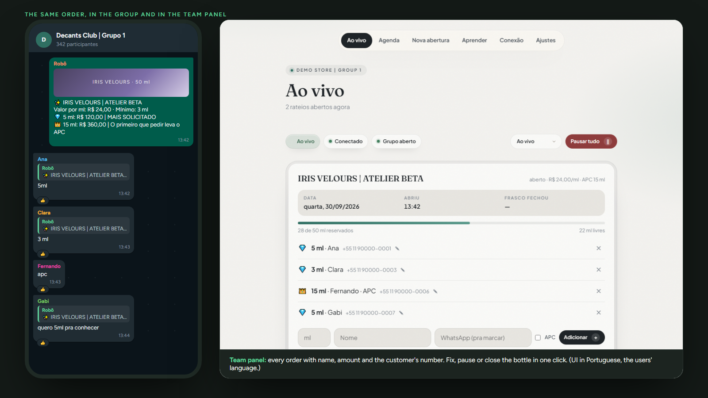
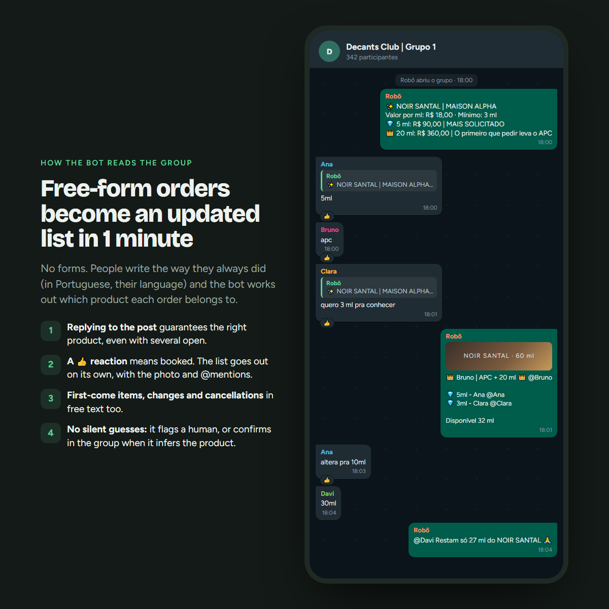
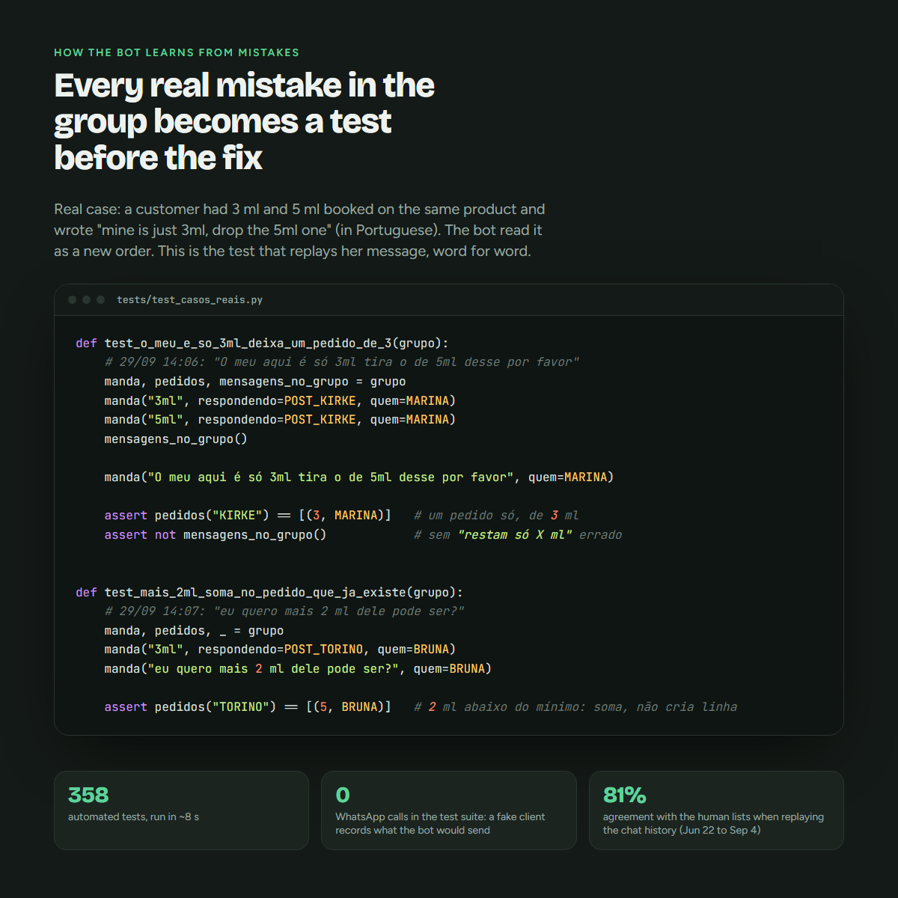
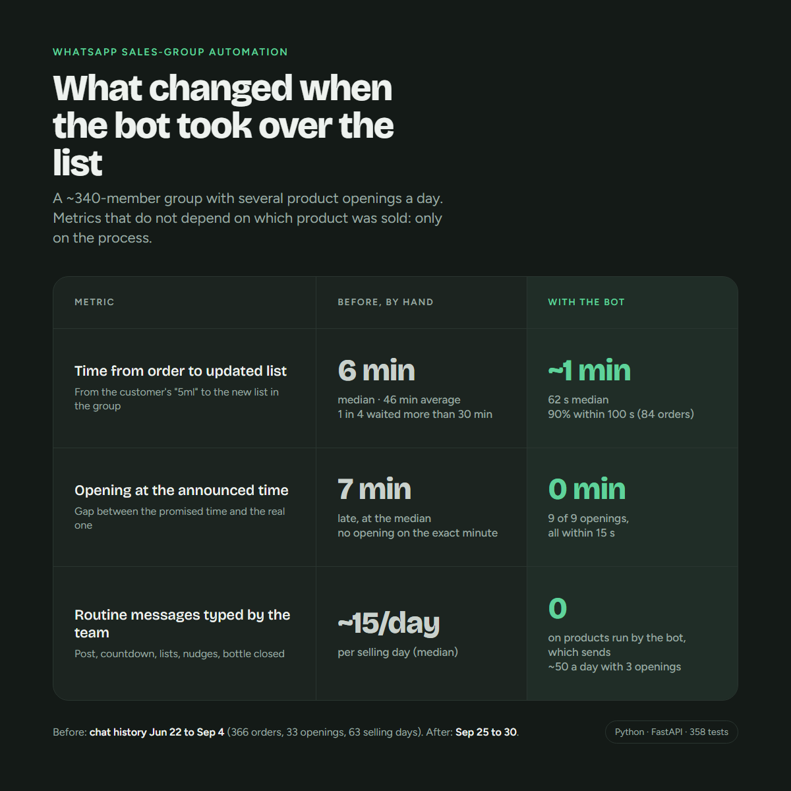

# WhatsApp Group Order Bot

[🇧🇷 Português](README.pt-BR.md) · 🇺🇸 English

An autonomous bot that runs the admin routine of a WhatsApp group-buying community: it opens and closes the group on
schedule, posts each product, reads members' orders from free-form chat, keeps the order list up to date and announces
when a batch is full. It comes with a web panel for the store owners.

Built for a real community that sells perfume **splits**, where a bottle is divided into small portions
("decants") and members reserve millilitres until the bottle is fully sold. The code in this repository is a
brand-free copy of the version running in production.



## The problem

Before the bot, an admin did everything by hand for every opening:

- close the group one hour before, post the product, open the group on time;
- read hundreds of messages like `5ml`, `apc`, `3 ml pra conhecer`, `altera pra 10`, `cancela o meu`;
- keep a running list of who reserved how much, re-post it, chase the last millilitres;
- announce **BOTTLE CLOSED** when it hits 100%.

Several bottles are often open at the same time, most people don't use WhatsApp's reply feature, and the chat mixes
orders with regular conversation. Getting the list wrong means charging the wrong person.

## What it does

| Area | Behaviour |
|---|---|
| Schedule | Closes the group N minutes before an opening, posts the product (photo + price table), counts down, opens the group on time |
| Orders | Parses free-form Portuguese messages into `order / first-come item / change / cancel / question / nothing` |
| Multiple bottles | Routes each order to the right bottle: reply to a post or list, product name in the message, or the bottle in focus |
| Safety | Never books an order for a product that isn't open in the system; unclear cases go to a human review queue |
| Lists | Batches orders and posts one updated list (with the product photo and @mentions) instead of one message per order |
| Engagement | Silence-based calls to action, "last millilitres" alerts, bottle-closed announcement |
| Modes | `off`, `observe` (reads everything, sends nothing), `shadow` (sends to the admin's DM), `live` |
| Panel | Live bottles, schedule, new opening with photo, manual add/remove/rename, pause/resume, review queue, settings |





## Architecture

```
WhatsApp group  <-->  whatsapp.py (neonize / whatsmeow)
                           |
                        motor.py  ---- clock loop: schedule, lists, alerts
                           |
     interpretar.py   rateio.py   post.py      pure rules, no I/O, heavily tested
                           |
                       estado.py  ---- one JSON file, atomic writes, survives restarts
                           |
                  painel.py + ui.py (FastAPI, server-rendered HTML)
```

- **Rules are pure functions** (`interpretar`, `rateio`, `post`): message in, decision out. The engine (`motor`) is the
  only part that talks to WhatsApp and the clock, which keeps the logic testable without a phone.
- **State is a single JSON file** with atomic writes and a lock. At this scale (a few dozen orders per opening) a database
  would add operations without adding value.
- **Deployed as one systemd service** on a small VPS, behind Caddy (automatic HTTPS), with a daily backup.

## Measured impact (Sep 25 to 30 vs. the manual history, Jun 22 to Sep 4)



The "before" numbers come from the group's own chat export (Jun 22 to Sep 4: 366 orders, 33 announced openings, 63 selling days) and
measure the process, not the product: how long a member waited for the updated list after ordering, how far the
actual opening drifted from the announced time, and how many routine messages (post, countdown, list, nudges,
bottle closed) the admins typed per selling day. The "after" numbers come from the bot's own log (84 orders, 9 openings). The bot sends more routine
messages than the team did (~50 on a day with 3 openings) because it updates the list after every order; for the
products it runs, the team types none of them. Leftovers posted by hand are still handled by the admins.

## Design decisions

- **Rules before AI.** Orders are short and repetitive (`5ml`, `apc`). A deterministic parser is cheaper, faster and
  explainable, and it is validated against real history. An optional LLM fallback exists but is off by default.
- **Measure against real data before going live.** `scripts/replay_historico.py` replays a full WhatsApp export and
  compares the bot's list with the list the human admin actually posted. On the replayed history, the bot's list
  matched the admin's exactly or within one item in **81%** of the list snapshots.
- **Observe mode first.** Before it was allowed to speak, the bot read the real group without sending anything,
  feeding a review queue (`Aprender`).
- **No silent guesses.** When in doubt (a reply to an unrelated image, a product that isn't open) the bot does not
  book the order and notifies an admin. When it has to infer the product (a bare "5ml" with several open), it books
  it and confirms in the group right away, so the customer can correct it. A wrong list costs more than a missed one.
- **Every production incident became a test.** Examples: a first-come item size missing from the price table, two
  openings one hour apart closing the group on top of each other, a customer's intent word parsed as their name.

## Tests

```
pytest            # 358 tests, ~8 s
```

The suite covers the parser, list rendering, multi-bottle routing, replies, restarts, the schedule (including
back-to-back openings), observe mode and the panel (FastAPI TestClient). A fake WhatsApp client records every
message the bot would send.

## Try it without WhatsApp

```
pip install -r requirements.txt
python demo.py          # http://127.0.0.1:8080
```

The demo uses the real engine and panel with a simulated group: two bottles open, fictional customers ordering every
few seconds, and the terminal shows exactly what the bot would post.

## Run it for real

1. `cp .env.example .env` and set `PAINEL_SENHA` and the group name.
2. `python main.py`, open the panel, scan the QR code in **Conexão** with the admin phone.
3. Start in **Observando**, then **Sombra**, then **Ao vivo**.

Server install (Ubuntu, systemd, Caddy, backups): see [`deploy/DEPLOY.md`](deploy/DEPLOY.md).

## Stack

Python 3.12 · neonize (whatsmeow) · FastAPI · uvicorn · pytest · systemd · Caddy

## Notes

- The code and panel are in Portuguese because the users are Brazilian; this README explains the domain.
- WhatsApp connectivity uses the WhatsApp Web multi-device protocol through
  [neonize](https://github.com/krypton-byte/neonize). This project is not affiliated with WhatsApp or Meta. Use a
  dedicated number and keep message volume human-like.
- All customer names and phone numbers in this repository are fictional. The replay history and any real chat
  export stay out of git (`.gitignore`).
