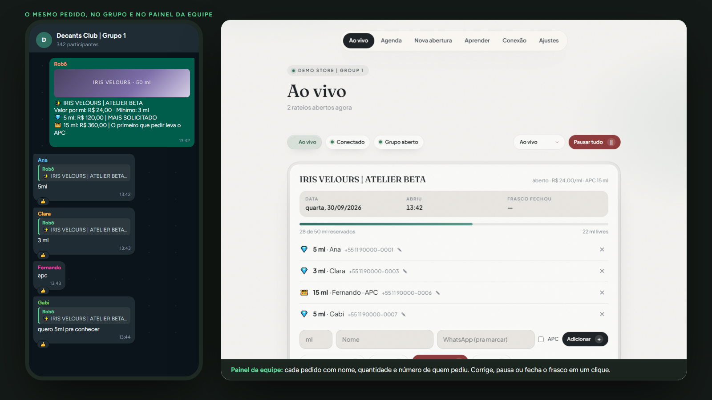
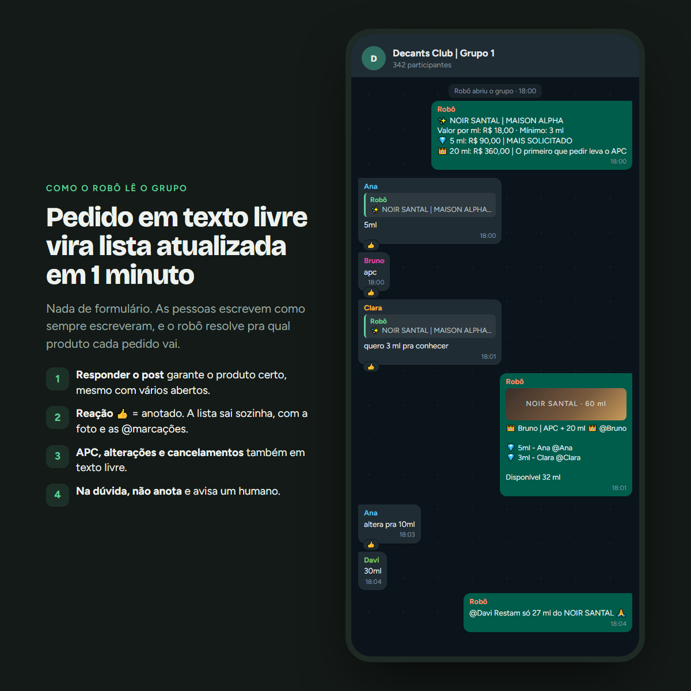
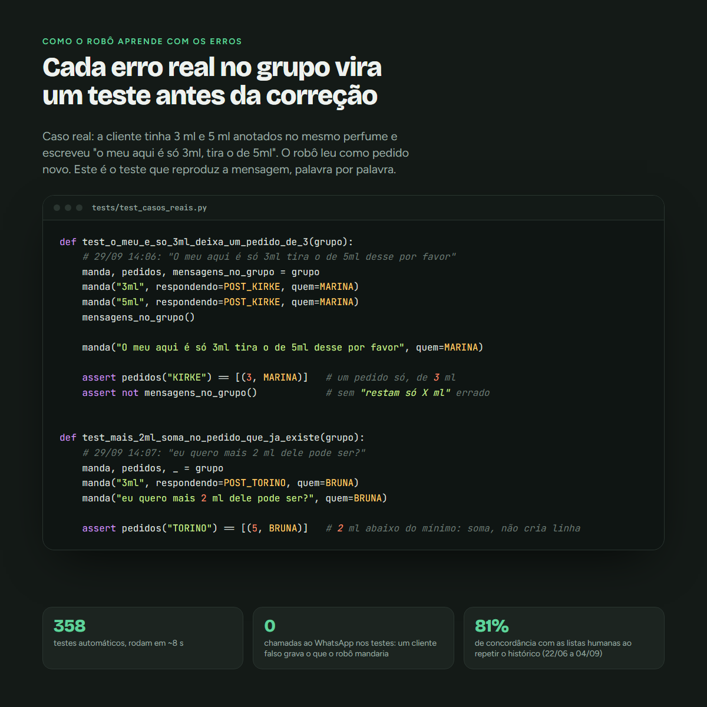
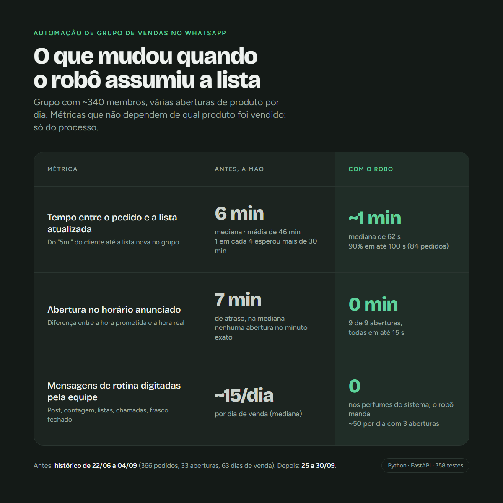

# Robô de Pedidos para Grupo de WhatsApp

🇧🇷 Português · [🇺🇸 English](README.md)

Um robô autônomo que faz a rotina de admin de um grupo de compras coletivas no WhatsApp: abre e fecha o grupo no
horário, posta cada produto, lê os pedidos escritos em texto livre, mantém a lista de pedidos atualizada e avisa
quando um lote fecha. Vem com um painel web para a equipe.

Feito para uma comunidade real que vende **decants** de perfume: um frasco é dividido em porções pequenas e os
membros reservam mililitros até o frasco esgotar. O código deste repositório é uma cópia sem marca da versão que
roda em produção.



## O problema

Antes do robô, um admin fazia tudo à mão em cada abertura:

- fechar o grupo uma hora antes, postar o produto, abrir o grupo na hora;
- ler centenas de mensagens como `5ml`, `apc`, `3 ml pra conhecer`, `altera pra 10`, `cancela o meu`;
- manter a lista de quem reservou quanto, repostar a cada pedido, correr atrás dos últimos mililitros;
- anunciar **FRASCO FECHADO** ao chegar em 100%.

Vários frascos costumam ficar abertos ao mesmo tempo, quase ninguém usa o "responder" do WhatsApp, e a conversa
mistura pedidos com bate-papo. Errar a lista significa cobrar a pessoa errada.

## O que ele faz

| Área | Comportamento |
|---|---|
| Agenda | Fecha o grupo N minutos antes da abertura, posta o produto (foto + tabela de preços), faz a contagem regressiva e abre o grupo na hora |
| Pedidos | Interpreta mensagens em português livre como `pedido / APC (primeiro que pedir leva) / alteração / cancelamento / dúvida / nada` |
| Vários frascos | Manda cada pedido para o frasco certo: resposta ao post ou à lista, nome do produto na mensagem, ou o frasco em destaque |
| Segurança | Nunca anota pedido de produto que não está aberto no sistema; casos duvidosos vão para uma fila de revisão humana |
| Listas | Junta os pedidos e posta uma lista atualizada (com a foto e as @menções) em vez de uma mensagem por pedido |
| Engajamento | Chamadas quando o grupo silencia, avisos de "últimos mililitros", anúncio de frasco fechado |
| Modos | `desligado`, `observando` (lê tudo, não manda nada), `sombra` (manda só para o privado do admin), `ao vivo` |
| Painel | Frascos ao vivo, agenda, nova abertura com foto, adicionar/remover/corrigir à mão, pausar/retomar, fila de revisão, ajustes |





## Arquitetura

```
Grupo do WhatsApp  <-->  whatsapp.py (neonize / whatsmeow)
                              |
                           motor.py  ---- relógio: agenda, listas, avisos
                              |
        interpretar.py   rateio.py   post.py      regras puras, sem I/O, muito testadas
                              |
                          estado.py  ---- um arquivo JSON, gravação atômica, sobrevive a reinícios
                              |
                     painel.py + ui.py (FastAPI, HTML renderizado no servidor)
```

- **As regras são funções puras** (`interpretar`, `rateio`, `post`): mensagem entra, decisão sai. O motor (`motor`) é a
  única parte que fala com o WhatsApp e com o relógio, o que deixa a lógica testável sem celular.
- **O estado é um único arquivo JSON**, com gravação atômica e trava. Nessa escala (algumas dezenas de pedidos por abertura) um
  banco de dados só acrescentaria operação, sem acrescentar valor.
- **Roda como um serviço systemd** numa VPS pequena, atrás do Caddy (HTTPS automático), com backup diário.

## Impacto medido (25 a 30/09 vs. o histórico manual, de 22/06 a 04/09)



Os números do "antes" vêm do export do próprio grupo (22/06 a 04/09: 366 pedidos, 33 aberturas anunciadas, 63 dias de venda) e
medem o processo, não o produto: quanto tempo um membro esperou pela lista atualizada depois de pedir, quanto a
abertura real se afastou do horário anunciado e quantas mensagens de rotina (post, contagem, lista, chamadas, frasco
fechado) os admins digitavam por dia de venda. Os números do "depois" vêm do registro do próprio robô (84 pedidos, 9 aberturas). O robô manda mais
mensagens de rotina que a equipe mandava (~50 num dia com 3 aberturas), porque atualiza a lista a cada pedido; nos
perfumes que ele cuida, a equipe não digita nenhuma. Sobras postadas à mão continuam com os admins.

## Decisões de projeto

- **Regras antes de IA.** Pedido é texto curto e repetitivo (`5ml`, `apc`). Um interpretador determinístico é mais
  barato, mais rápido, explicável e validado contra o histórico real. Existe um fallback opcional com LLM, desligado
  por padrão.
- **Medir com dados reais antes de ligar.** `scripts/replay_historico.py` reproduz um export completo do WhatsApp e
  compara a lista do robô com a lista que o admin de fato postou. No histórico reproduzido, a lista do robô saiu
  igual à do admin ou com 1 item de diferença em **81%** das fotos da lista.
- **Primeiro só observando.** Antes de ganhar permissão para falar, o robô leu o grupo real sem mandar nada,
  alimentando a fila de revisão (`Aprender`).
- **Na dúvida, não anota.** Resposta a uma imagem sem relação, produto que não está aberto, pedido depois de um
  reinício: o robô não anota e avisa um admin. Uma lista errada custa mais que um pedido perdido.
- **Todo incidente em produção virou teste.** Exemplos: tamanho do APC fora da tabela de preços, duas aberturas com
  1 hora de diferença fechando o grupo uma em cima da outra, palavra de intenção do cliente lida como nome.

## Testes

```
pytest            # 358 testes, ~8 s
```

A suíte cobre o interpretador, a renderização da lista, o roteamento entre vários frascos, respostas, reinícios, a
agenda (inclusive aberturas seguidas), o modo observando e o painel (TestClient do FastAPI). Um WhatsApp falso grava
cada mensagem que o robô mandaria.

## Experimente sem WhatsApp

```
pip install -r requirements.txt
python demo.py          # http://127.0.0.1:8080
```

A demo usa o motor e o painel reais com um grupo simulado: dois frascos abertos, clientes fictícios pedindo a cada
poucos segundos, e o terminal mostra exatamente o que o robô postaria.

## Rodando de verdade

1. `cp .env.example .env` e defina `PAINEL_SENHA` e o nome do grupo.
2. `python main.py`, abra o painel e leia o QR code em **Conexão** com o celular admin.
3. Comece em **Observando**, depois **Sombra**, depois **Ao vivo**.

Instalação no servidor (Ubuntu, systemd, Caddy, backups): veja [`deploy/DEPLOY.md`](deploy/DEPLOY.md).

## Stack

Python 3.12 · neonize (whatsmeow) · FastAPI · uvicorn · pytest · systemd · Caddy

## Observações

- A conexão com o WhatsApp usa o protocolo multi-dispositivo do WhatsApp Web, através da biblioteca
  [neonize](https://github.com/krypton-byte/neonize). Este projeto não tem ligação com o WhatsApp nem com a Meta.
  Use um número dedicado e mantenha um volume de mensagens parecido com o de uma pessoa.
- Todos os nomes de clientes e telefones deste repositório são fictícios. O histórico usado no replay e qualquer
  export real de conversa ficam fora do git (`.gitignore`).
